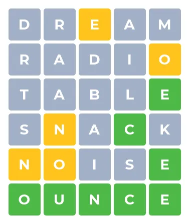

# WordWise

We are going to build a game where a user has 5 tries to guess a mystery word.



## Project Setup

Begin by cloning the provided project and importing it into your workspace.

`git clone <url for github repository>`

After cloning this repository you want to run these commands

`git checkout -b development`

This will create a branch named development and switch you to it. The development branch is where you will make all your commits.

```
git push -u origin development
```

This will push your development branch up to Github. Don't forget to make a pull request after you've made your first commit.

## Bootstrap Link

```html
<link
  href="https://cdn.jsdelivr.net/npm/bootstrap@5.3.3/dist/css/bootstrap.min.css"
  rel="stylesheet"
/>
```

## Spinner

Here's the spinner you can copy and paste into the HTML

🌀

## Rainbow animation

Here is the code we're going to light up the title if the user wins

```css
@keyframes rainbow {
  0%,
  100% {
    color: rgb(255, 0, 0);
  }
  8% {
    color: rgb(255, 127, 0);
  }
  16% {
    color: rgb(255, 255, 0);
  }
  25% {
    color: rgb(127, 255, 0);
  }
  33% {
    color: rgb(0, 255, 0);
  }
  41% {
    color: rgb(0, 255, 127);
  }
  50% {
    color: rgb(0, 255, 255);
  }
  58% {
    color: rgb(0, 127, 255);
  }
  66% {
    color: rgb(0, 0, 255);
  }
  75% {
    color: rgb(127, 0, 255);
  }
  83% {
    color: rgb(255, 0, 255);
  }
  91% {
    color: rgb(255, 0, 127);
  }
}
```
